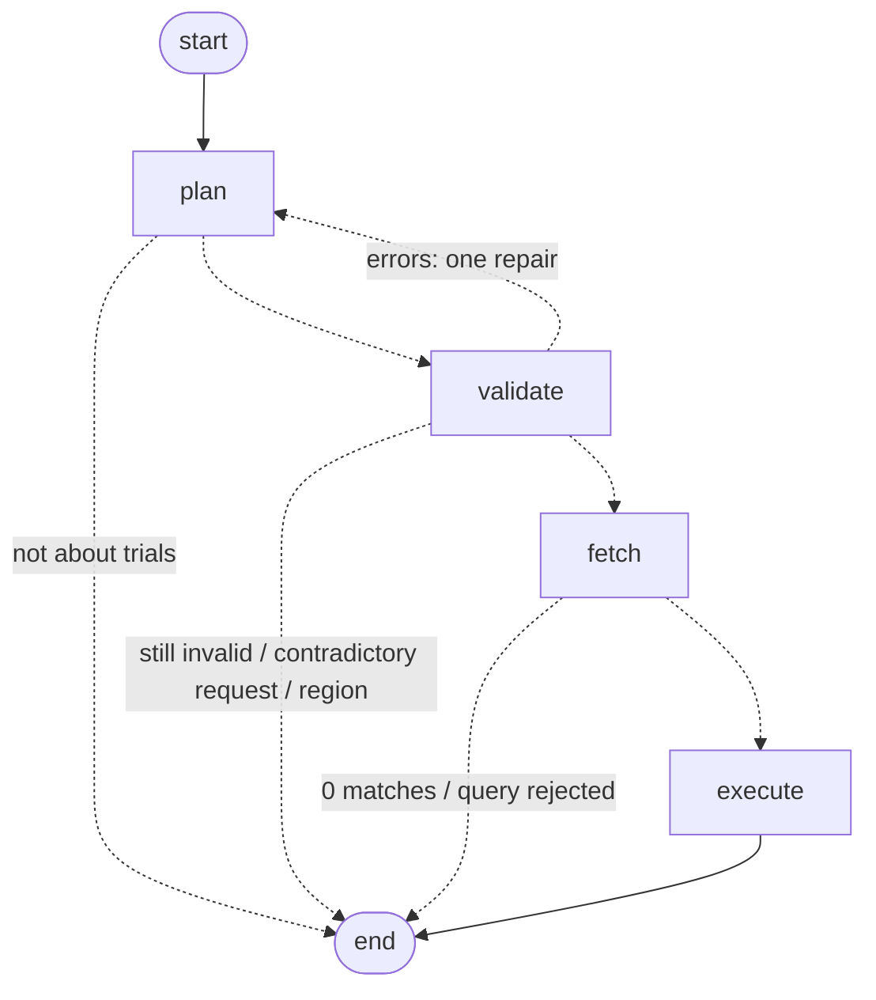

# ClinicalTrials.gov Query-to-Visualization Agent

A backend that turns a natural-language question about clinical trials into a **structured,
citation-backed visualization spec**, using live data from the
[ClinicalTrials.gov API v2](https://clinicaltrials.gov/data-api/api).

**Core rule: the LLM plans, code computes.** The model's only job is to turn the question into a
typed, validated query plan. It never sees trial data and never computes a value. Fetching,
counting, chart selection and citations are deterministic Python, so every plotted number can be
traced to specific trial records. (The model does still write a few labels, which is a known gap;
see [§7](#7-limitations-and-what-i-would-improve).)

**At a glance**
- Seven question classes (distribution, time trend, comparison, geography, network, enrollment
  distribution, count) produce six visualization types through one plan → validate → fetch →
  execute pipeline.
- **Deep citations** on every bar, bin, node and edge: contributing NCT IDs, plus the exact field
  value that put each trial there. A live audit re-fetched all 260 cited trials in the examples and
  confirmed all 498 excerpts ([`examples/verification.json`](examples/verification.json)).
- **Exact numbers at any scale.** Small cohorts are counted from every record. Huge ones (e.g. 123,589
  cancer trials) use the registry's own per-bucket totals. Anything sampled says so on the axis.
- Questions in **any language** (one example is Korean). The caller's structured fields always
  override the LLM, and contradictions are reported rather than guessed around.
- **134 offline tests**, including one proving no trial data ever reaches the LLM, plus opt-in live
  tests that check exact counts against the registry.

Design notes written before any code: [`docs/implementation-plan.md`](docs/implementation-plan.md).
The commit history records the build step by step, including two rounds of independent review
([§8](#8-ai-tools-validation-and-what-was-deliberate)).

---

## 1. How to run

Requires Python 3.12+ and an OpenAI API key.

```bash
python3.12 -m venv .venv && source .venv/bin/activate
pip install -r requirements.txt
cp .env.example .env          # then set OPENAI_API_KEY
uvicorn app.main:app --reload # run from the repo root; serves http://127.0.0.1:8000
```

Try it in the browser at <http://localhost:8000/docs> (**POST /v1/visualize** → *Try it out*), or:

```bash
curl -s -X POST localhost:8000/v1/visualize \
  -H 'content-type: application/json' \
  -d '{"query": "How has the number of trials for this drug changed over time?", "drug_name": "Pembrolizumab"}'
```

| Env var | Default | Meaning |
|---|---|---|
| `OPENAI_API_KEY` | – | Required to answer questions. The server starts without it, but `/v1/visualize` returns 502 `planner_unavailable`. |
| `OPENAI_MODEL` | `gpt-4.1-mini` | Must be one of the models in [`docs/openai-rules.md`](docs/openai-rules.md); anything else fails at startup. |

Tests:

```bash
pytest            # 134 offline tests: recorded registry responses + a scripted LLM, no key or network
pytest -m live    # opt-in: checks against the real ClinicalTrials.gov API (~40 requests, ~1 min)
```

Reproduce the example outputs and audit their citations against the live registry:

```bash
python -m examples.run_examples      # needs OPENAI_API_KEY; writes examples/outputs/*.json
python -m scripts.verify_examples    # re-fetches every cited trial; writes examples/verification.json
python -m scripts.record_fixtures    # re-records the offline test fixtures
```

ClinicalTrials.gov rate-limits bursts (its limit is undocumented). Leave about a minute between
questions over very large cohorts; if it throttles anyway, the response falls back to a labelled
sample and says so.

---

## 2. Request schema

`POST /v1/visualize` with a JSON body. Only `query` is required.

| Field | Type | Required | Validation | Effect |
|---|---|---|---|---|
| `query` | string | **yes** | 1–1000 chars after trimming | The question. Any language. |
| `drug_name` | string | no | 1–200 chars | Filters by intervention (`query.intr`). |
| `condition` | string | no | 1–200 chars | Filters by condition (`query.cond`). |
| `sponsor` | string | no | 1–200 chars | Filters by **lead** sponsor (`query.lead`). |
| `country` | string | no | 1–100 chars | Filters by site country (`query.locn`). Aliases that change results are normalized, e.g. "Korea" → "South Korea". Regions like "Europe" are refused. |
| `trial_phases` | string[] | no | each one of `EARLY_PHASE1`, `PHASE1`, `PHASE2`, `PHASE3`, `PHASE4`, `NA` | Restricts to these phases. |
| `statuses` | string[] | no | each a registry status, e.g. `RECRUITING`, `COMPLETED` | Restricts to these overall statuses. |
| `start_year` | int | no | 1900–2100 | Earliest trial start year (inclusive). |
| `end_year` | int | no | 1900–2100, ≥ `start_year` | Latest trial start year (inclusive). |
| `chart_type` | string | no | a visualization `type` (§3) | Preferred chart. Used only if it fits the question; otherwise overridden and explained in `meta.visualization_rationale`. |
| `top_n` | int | no | 1–50, default 15 | Maximum categories or nodes shown. |
| `max_records` | int | no | 100–5000, default 5000 | Maximum trial records fetched per search. |
| `max_citations_per_datum` | int | no | 0–20, default 3 | Citation excerpts attached to each datum. |

Rules:
- **Unknown fields are rejected with 422.** A misspelled filter that silently does nothing is worse
  than an error.
- **Structured fields override the question.** If `drug_name` is set, it wins over whatever drug the
  question names, and `meta.notes` records the difference ("Request field 'drug_name'
  (atezolizumab) is used instead of 'nivolumab' from the question.").
- **Contradictions fail fast.** `drug_name: "pembrolizumab"` with "compare semaglutide vs
  tirzepatide" returns `error: conflicting_constraints` without fetching anything (§6).

---

## 3. Response schema

Every response has the same envelope:

```jsonc
{
  "schema_version": "1.0",
  "status": "ok",            // ok | no_data | unsupported | error
  "visualization": { ... },  // present only when status is "ok"
  "meta": { ... },           // always present
  "error": { "code": "...", "message": "..." }  // present only when status is "error"
}
```

| `status` | Meaning |
|---|---|
| `ok` | A visualization was produced. |
| `no_data` | The search ran but matched no trials; `meta.queries` shows exactly what was searched. (A *count* question with no matches is `ok` with the value 0.) |
| `unsupported` | The question can't be answered from the registry: off-topic, medical advice, or a region instead of countries. |
| `error` | No chart was produced; `error.code` says why. No guessed chart is ever returned. |

| `error.code` | HTTP | Meaning |
|---|---|---|
| `invalid_plan` | 200 | The question could not be turned into a valid query, even after one repair attempt. |
| `conflicting_constraints` | 200 | The request contradicts itself (see §2). Nothing is fetched. |
| `query_rejected` | 200 | ClinicalTrials.gov rejected the search terms (HTTP 400 upstream). |
| `upstream_unavailable` / `planner_unavailable` | 502 | ClinicalTrials.gov or the LLM provider failed after retries. |
| `internal_error` | 500 | A bug on our side, still returned in this envelope. |

A request body that fails validation returns 422. Every other outcome (`ok`, `no_data`,
`unsupported`, and the first three error codes) is HTTP 200 with the status in the body.

### 3.1 `visualization`

`type` selects the shape. Every `encoding.*.field` names a key that exists in **every** `data` row;
the server validates this before responding, so a renderer needs only `encoding` + `data`. The JSON
Schema for every type is published at `/openapi.json`.

| `type` | `encoding` channels | `data` |
|---|---|---|
| `bar_chart` | `x`, `y` | rows |
| `grouped_bar_chart` | `x`, `y`, `series` | rows in long format: one per (x, series) pair; a zero means zero trials |
| `time_series` | `x` (temporal), `y`, optional `series` | one row per year (per series); years with no trials are included as 0 |
| `histogram` | `x` (bin start), `x2` (bin end), `y` | one row per bin |
| `metric` | `value` | a single row: the question needs a number, not a chart |
| `network_graph` | `node` {`id`, `label`, `size`, `color`}, `edge` {`source`, `target`, `weight`} | `{ "nodes": [...], "edges": [...] }` |

A channel is `{field, type, label, label_field?}`, where `type` is `nominal`, `ordinal`,
`quantitative` or `temporal`.

**Raw value + display label.** Categorical rows carry the registry's raw value and a display label
side by side, and the channel's `label_field` names the label key. Plot the raw value; print the label:

```json
{ "phase": "PHASE2", "phase_label": "Phase 2", "trial_count": 4581 }
```

### 3.2 Deep citations

Every datum (bar, time bucket, histogram bin, node, edge) carries its evidence:

```jsonc
{
  "phase": "PHASE3", "phase_label": "Phase 3", "trial_count": 41,
  "supporting_nct_ids": ["NCT01234567", "..."],   // contributing trials
  "supporting_nct_ids_complete": true,             // false only for huge cohorts (below)
  "citation_count": 41,                            // always equals the plotted count
  "citations": [                                   // first max_citations_per_datum trials
    {
      "nct_id": "NCT01234567",
      "field": "protocolSection.designModule.phases",
      "excerpt": "[\"PHASE3\"]",                     // exact value from the API response
      "title": "A Study of Pembrolizumab in ...",
      "url": "https://clinicaltrials.gov/study/NCT01234567"
    }
  ]
}
```

- **`excerpt`** is the exact field value that placed the trial in this datum (lists are
  JSON-encoded). For a derived bucket such as "Phase 1/Phase 2", it is the raw
  `["PHASE1", "PHASE2"]`. For a network edge, it quotes both endpoints from the same record.
- **`supporting_nct_ids`** lists every contributing trial. The one exception is cohorts too large to
  fetch, counted with the registry's per-bucket totals (`coverage.aggregation_mode:
  "exact_counts"`). There it lists the cited example trials, and `supporting_nct_ids_complete` is
  `false`. `citation_count` is still the exact total.

### 3.3 `meta`

| Field | Meaning |
|---|---|
| `interpretation` | What was computed, in words, built from the plan by a template. In comparisons it includes the cohort labels, which the planner writes (see §7). |
| `queries[]` | Each ClinicalTrials.gov search behind the chart (one per cohort in a comparison): `label`, normalized `filters`, the exact `api_params` sent, `total_matching` (the API's own count), `records_analyzed`, `truncated`. |
| `coverage` | How the numbers relate to the trials. |
| `render` | Drawing hints: `sort` {`field`, `order`}, `time_granularity`, `units` per channel, `grouping` (the series key), `pruning` (for networks). |
| `visualization_rationale` | The chosen `type`, where it came from (`request`, `llm` or `rule_default`), any overridden suggestion, and why. |
| `assumptions[]` | Interpretation choices a reader would otherwise have to guess, e.g. how multi-phase trials are counted. |
| `notes[]` | Anything worth knowing about this run: overrides, parts of the question left unanswered, years not plotted, sampling. |
| `plan` | The validated query plan that was executed. |
| `source`, `data_as_of`, `generated_at` | Provenance: the API and its data timestamp. |

`coverage` contains:
- **`aggregation_mode`**:
  - `all_records`: every matching trial was analyzed;
  - `exact_counts`: too many to fetch, so each bar is the registry's exact per-bucket total;
  - `sample`: counts cover only the first `records_analyzed` trials, and the y-axis label says so.
- **`groupby_semantics`**:
  - `partition`: each trial is in exactly one bucket, so buckets sum to the total;
  - `overlapping`: a trial can be in several buckets, e.g. multi-country trials.
- **`bucket_sum`**, **`unclassified_count`** and **`overlap_note`**.
- **`excluded[]`**: trials left out of the chart, by reason.
- **`buckets_not_shown`**: categories counted but beyond `top_n`.

---

## 4. Example runs

**The complete, unedited input/output pairs are in [`examples/outputs/`](examples/outputs/)**, one
file per example, linked in the table below. Each file holds the exact request, the HTTP status and
the full JSON the API returned. They come from live runs (OpenAI `gpt-4.1-mini` planner, registry
data as of 2026-09-25). All of them analyzed every matching trial (`aggregation_mode:
"all_records"`). The files are 14–107 KB because every datum lists all of its supporting trial IDs,
so this section shows abridged versions below.

| # | Request | Type | Result (abridged) | Full output |
|---|---|---|---|---|
| 1 | "How has the number of trials for this drug changed per year since 2015?" + `drug_name: "Pembrolizumab"` | `time_series` | 2,894 trials; 120 in 2015 → peak of 298 in 2022 → 211 so far in 2026 | [`01_time_trend_pembrolizumab.json`](examples/outputs/01_time_trend_pembrolizumab.json) |
| 2 | "Which countries have the most recruiting trials for breast cancer?" + `top_n: 10` | `bar_chart` | 2,452 trials; United States 924, China 648, France 202 … (overlapping: a multi-country trial counts in each country) | [`02_geographic_breast_cancer.json`](examples/outputs/02_geographic_breast_cancer.json) |
| 3 | "Compare phases for trials involving Semaglutide vs Tirzepatide." | `grouped_bar_chart` | 760 vs 290 trials; Phase 3: 164 vs 50 | [`03_comparison_semaglutide_tirzepatide.json`](examples/outputs/03_comparison_semaglutide_tirzepatide.json) |
| 4 | "Show a network of sponsors and drugs for KRAS-mutant non-small cell lung cancer trials." | `network_graph` | 79 trials; strongest links Eli Lilly ↔ Pembrolizumab and Merck ↔ Calderasib (4 trials each) | [`04_network_kras_nsclc.json`](examples/outputs/04_network_kras_nsclc.json) |
| 5 | "한국에서 모집 중인 위암 임상시험은 단계별로 어떻게 분포되어 있나요?" (Korean: "How are recruiting gastric cancer trials in Korea distributed across phases?") | `bar_chart` | 74 trials; Phase 1/Phase 2 18, Not Applicable 14, Phase 3 13 … | [`05_korean_gastric_cancer_phases.json`](examples/outputs/05_korean_gastric_cancer_phases.json) |

Extra runs covering the remaining types and an out-of-scope question:
- a [drug co-occurrence network](examples/outputs/06_extra_drug_cooccurrence_myeloma.json)
  (multiple myeloma: dexamethasone ↔ lenalidomide in 66 trials);
- an [enrollment histogram](examples/outputs/07_extra_enrollment_histogram_psoriasis.json);
- a [single metric](examples/outputs/08_extra_count_pfizer.json) ("How many Phase 3 trials is Pfizer
  running that are currently recruiting?" → 47, no chart needed);
- an [unsupported question](examples/outputs/09_extra_unsupported.json) (weather → `status: "unsupported"`).

**One complete example, unedited.** This is the full file for extra run 8, the smallest one, pasted
exactly as the API returned it. The value 47 is the registry's exact total, so the service fetches
only the 3 trials it cites. That is why `records_analyzed` is 3, `truncated` is true, and
`supporting_nct_ids_complete` is false.

```json
{
  "request": {
    "query": "How many Phase 3 trials is Pfizer running that are currently recruiting?"
  },
  "http_status": 200,
  "response": {
    "schema_version": "1.0",
    "status": "ok",
    "visualization": {
      "type": "metric",
      "title": "Number of recruiting Phase 3 trials led by Pfizer",
      "encoding": {
        "value": {
          "field": "trial_count",
          "type": "quantitative",
          "label": "Number of trials"
        }
      },
      "data": [
        {
          "supporting_nct_ids": [
            "NCT07768345",
            "NCT07062965",
            "NCT07222800"
          ],
          "supporting_nct_ids_complete": false,
          "citation_count": 47,
          "citations": [
            {
              "nct_id": "NCT07768345",
              "field": "protocolSection.identificationModule.briefTitle",
              "excerpt": "A Study to Learn About Revaccination With a Vaccine Called RSVpreF in Immunocompromised Adults",
              "title": "A Study to Learn About Revaccination With a Vaccine Called RSVpreF in Immunocompromised Adults",
              "url": "https://clinicaltrials.gov/study/NCT07768345"
            },
            {
              "nct_id": "NCT07062965",
              "field": "protocolSection.identificationModule.briefTitle",
              "excerpt": "A Study to Learn About the Study Medicine Called PF-07248144 in Combination With Fulvestrant in People With HR-positive, HER2-negative Advanced or Metastatic Breast Cancer Who Progressed After a Prior Line of Treatment.",
              "title": "A Study to Learn About the Study Medicine Called PF-07248144 in Combination With Fulvestrant in People With HR-positive, HER2-negative Advanced or Metastatic Breast Cancer Who Progressed After a Prior Line of Treatment.",
              "url": "https://clinicaltrials.gov/study/NCT07062965"
            },
            {
              "nct_id": "NCT07222800",
              "field": "protocolSection.identificationModule.briefTitle",
              "excerpt": "Symbiotic-GI-03: A Study to Learn About the Study Medicine Called PF-08634404 in Combination With Chemotherapy in Adult Participants With Metastatic Colorectal Cancer",
              "title": "Symbiotic-GI-03: A Study to Learn About the Study Medicine Called PF-08634404 in Combination With Chemotherapy in Adult Participants With Metastatic Colorectal Cancer",
              "url": "https://clinicaltrials.gov/study/NCT07222800"
            }
          ],
          "trial_count": 47
        }
      ]
    },
    "meta": {
      "interpretation": "Counted recruiting Phase 3 trials led by Pfizer. A single number answers this, so no chart is needed.",
      "queries": [
        {
          "filters": {
            "sponsor": "Pfizer",
            "phases": [
              "PHASE3"
            ],
            "statuses": [
              "RECRUITING"
            ]
          },
          "api_params": {
            "query.lead": "Pfizer",
            "filter.overallStatus": "RECRUITING",
            "filter.advanced": "AREA[Phase]PHASE3"
          },
          "total_matching": 47,
          "records_analyzed": 3,
          "truncated": true
        }
      ],
      "render": {
        "units": {
          "value": "trials"
        }
      },
      "visualization_rationale": {
        "chosen": "metric",
        "source": "llm",
        "reason": "A single number metric chart is appropriate to show the count of Phase 3 recruiting trials by Pfizer."
      },
      "assumptions": [
        "The value is the registry's own total match count for this search.",
        "A phase filter matches every trial that lists that phase, including combined phases: 'Phase 3' also matches Phase 2/Phase 3 trials."
      ],
      "notes": [],
      "plan": {
        "supported": true,
        "analysis": "count",
        "metric": "trial_count",
        "filters": {
          "sponsor": "Pfizer",
          "phases": [
            "PHASE3"
          ],
          "statuses": [
            "RECRUITING"
          ]
        },
        "compare": [],
        "top_n": 15,
        "chart_type_suggestion": "metric",
        "chart_rationale": "A single number metric chart is appropriate to show the count of Phase 3 recruiting trials by Pfizer."
      },
      "source": "ClinicalTrials.gov API v2",
      "data_as_of": "2026-09-25T09:00:04",
      "generated_at": "2026-09-27T10:37:23.246009Z"
    }
  }
}
```

**Example 5, abridged.** One of seven bars and one of three citations are shown; `meta.plan`, empty
lists and `generated_at` are omitted. Full file:
[`05_korean_gastric_cancer_phases.json`](examples/outputs/05_korean_gastric_cancer_phases.json).

```json
{
  "schema_version": "1.0",
  "status": "ok",
  "visualization": {
    "type": "bar_chart",
    "title": "Recruiting gastric cancer trials in South Korea by trial phase",
    "encoding": {
      "x": { "field": "phase", "type": "ordinal", "label": "Trial phase", "label_field": "phase_label" },
      "y": { "field": "trial_count", "type": "quantitative", "label": "Number of trials" }
    },
    "data": [
      {
        "supporting_nct_ids": ["NCT06663319", "NCT04389632", "NCT07812805", "... 9 in total"],
        "supporting_nct_ids_complete": true,
        "citation_count": 9,
        "citations": [
          {
            "nct_id": "NCT06663319",
            "field": "protocolSection.designModule.phases",
            "excerpt": "[\"PHASE1\"]",
            "title": "A Study of JNJ-89402638 for Metastatic Colorectal and Gastric Cancers",
            "url": "https://clinicaltrials.gov/study/NCT06663319"
          }
        ],
        "phase": "PHASE1",
        "phase_label": "Phase 1",
        "trial_count": 9
      }
    ]
  },
  "meta": {
    "interpretation": "Counted recruiting gastric cancer trials in South Korea in the registry, grouped by trial phase.",
    "queries": [
      {
        "filters": { "condition": "gastric cancer", "location": "South Korea", "statuses": ["RECRUITING"] },
        "api_params": { "query.cond": "gastric cancer", "query.locn": "South Korea", "filter.overallStatus": "RECRUITING" },
        "total_matching": 74,
        "records_analyzed": 74,
        "truncated": false
      }
    ],
    "coverage": {
      "aggregation_mode": "all_records",
      "groupby_semantics": "partition",
      "bucket_sum": 74,
      "unclassified_count": 0,
      "buckets_not_shown": 0
    },
    "render": { "sort": { "field": "phase", "order": "ascending" }, "units": { "y": "trials" } },
    "visualization_rationale": {
      "chosen": "bar_chart",
      "source": "llm",
      "reason": "A bar chart effectively shows the distribution of recruiting gastric cancer trials across different phases in South Korea."
    },
    "assumptions": [
      "Trials registered with two phases (e.g. Phase 1/Phase 2) are counted once, in a combined bucket. 'Not Applicable' (an explicit NA, typical of non-drug studies) and 'Not specified' (no phase recorded) are kept separate."
    ],
    "source": "ClinicalTrials.gov API v2",
    "data_as_of": "2026-09-25T09:00:04"
  }
}
```

The planner translated the Korean question into English search terms. The seven phase buckets sum
to exactly 74, the API's own `totalCount`.

**A network edge from example 4** (one citation shown, trial title omitted). The excerpt quotes both
endpoints from the same record:

```json
{
  "source": "sponsor:merck sharp & dohme llc",
  "target": "intervention:calderasib",
  "weight": 4,
  "supporting_nct_ids": ["NCT06345729", "NCT07190248", "NCT07554339", "NCT07431827"],
  "supporting_nct_ids_complete": true,
  "citation_count": 4,
  "citations": [
    {
      "nct_id": "NCT06345729",
      "field": "protocolSection.sponsorCollaboratorsModule.leadSponsor.name + protocolSection.armsInterventionsModule.interventions[].name",
      "excerpt": "\"Merck Sharp & Dohme LLC\" | \"Calderasib\"",
      "url": "https://clinicaltrials.gov/study/NCT06345729"
    }
  ]
}
```

---

## 5. How it works

The pipeline is an explicit [LangGraph](https://github.com/langchain-ai/langgraph) state machine
([`app/graph.py`](app/graph.py)). The diagram mirrors the compiled graph's edges
(`graph.get_graph().draw_mermaid()`), with labels added:



| Node | Code | What it does |
|---|---|---|
| `plan` | [`planner/llm_planner.py`](app/planner/llm_planner.py), [`prompts.py`](app/planner/prompts.py) | The **only** LLM call. It sends the question and the caller's structured fields and gets back a `QueryPlanLLM` via OpenAI Structured Outputs (strict JSON schema). Besides the plan, the model reports what the question itself named and which parts it can't answer, chosen from a fixed list. On a repair turn it also sees its previous draft and the exact validation errors. |
| `validate` | [`planner/validator.py`](app/planner/validator.py) | Converts the draft into a `QueryPlan` with real constraints. It applies the caller's structured fields (they always win), merges comparison cohorts and checks them for contradictions, fixes unambiguous slips deterministically (e.g. a time trend must group by year), and reports all of it in `notes`. Anything else goes back to the planner for one repair. |
| `fetch` | [`ctgov/`](app/ctgov/) | Builds API params, normalizes country spellings, and runs one search per cohort in parallel (with paging, retries and a cache). Each record becomes a `TrialRow` that keeps every value's field path and raw text. Cohorts above the record cap get exact per-bucket counts where the grouping allows ([`bucket_counts.py`](app/ctgov/bucket_counts.py)). |
| `execute` | [`engine/`](app/engine/) | Deterministic. Groups and counts through a dimension registry, chooses the chart, builds networks, attaches evidence, and assembles the response. |

A plan has one generic shape:
- `analysis`: distribution, time_trend, comparison, geographic, network, numeric_distribution or count;
- `group_by`, `filters`, `compare` cohorts, `network` endpoints, `top_n`.

Every question class in the assignment's appendix maps onto it, so no question needs its own code path.

---

## 6. Design decisions and tradeoffs

**The LLM plans; code computes.** The model never sees trial data and never computes a value, so no
plotted number can be hallucinated. [`test_no_trial_data_reaches_the_llm`](tests/test_graph.py)
captures every message sent to the model, including a repair turn, and asserts that no NCT ID, trial
title or match count appears in them. *Tradeoff:* a question outside the plan schema can't be
answered. It gets an `error` or `unsupported` status, or a note saying what was left out, rather
than a best guess.

**Chart type: the LLM suggests, rules decide.** The planner proposes a chart with a one-line
rationale. [`chart_rules.py`](app/engine/chart_rules.py) maps each question class to the chart types
that fit its data shape. The priority is the caller's `chart_type`, then the LLM's suggestion, then
the rule default. Any override is reported, so the LLM can express judgment but can never produce an
unrenderable spec.

**Validation: repair once, fix the obvious deterministically.** Errors go back to the model once
with the exact messages; if the second draft still fails, the response is `status: "error"` with no
chart. Unambiguous slips are fixed in code and noted, which saves an LLM round trip.

**Say what the numbers mean.** `coverage.groupby_semantics` separates two kinds of dimension:
- a *partition* (phase, status, year, sponsor), where each trial is in one bucket, so bars sum to the
  total;
- *overlapping* dimensions (country, intervention, condition), where a trial with sites in five
  countries is in five bars.

Multi-phase trials get one combined "Phase 1/Phase 2" bucket instead of being counted twice. An
explicit `NA` phase (237,522 trials registry-wide) and a missing phase (143,294) stay separate.

**Count every record when possible; switch to exact registry counts when that can't scale.**
Counting fetched records is what makes complete citations and networks possible, because every datum
knows exactly which trials produced it. It breaks above the record cap (default 5,000). "How many
cancer trials started each year?" matches 123,589 trials, and counting only the first 5,000 showed
237 for 2020 against a real 6,351. Above the cap, the service takes one of two paths:
- **Dimensions with a fixed set of values** (phase, status, sponsor type, intervention type, start
  year) use *exact-count mode*.
  - Each bar is the registry's own total for that bucket: one `countTotal` request per bucket, with
    the bucket's condition ANDed onto the search. For cancer, the nine phase buckets sum to exactly
    123,589, and 2020 shows 6,351.
  - The same requests return a few trials to cite.
  - All cohorts in a comparison count the same values, so a zero bar is a real zero.
- **Open dimensions** (country, sponsor, drug) and networks stay a *sample* of the first 5,000
  records. The y-axis label says "among the first 5,000 of N matching trials", so the undercount
  can't be missed.

The registry's rate limit is undocumented; it returned 429s after roughly 40–60 quick requests. So
exact mode is budgeted at 20 count requests per response:
- **Time series** are counted over a window ending at the current year. Years before the window,
  and anticipated future starts, are counted once and reported as not plotted. A year that wasn't
  counted is never drawn as zero: the x-axis label and `notes` state the window.
- **If exact counting can't run** (over budget, or rate-limited), the cohort gets the full
  5,000-record fetch and the chart is a labelled sample.
- **Count questions** always use the API's exact `totalCount`.

Opt-in live tests (`pytest -m live`) re-check exact-mode output against independent registry counts.

**Comparisons: cohorts narrow the caller's filters and never contradict them.** Each cohort's
filters are merged with the shared ones and validated:
- A structured field that no cohort varies applies to every cohort.
- Phases, statuses and year ranges intersect, so a cohort can't widen what the caller asked for.
- A text field that contradicts every cohort is `conflicting_constraints`. Re-asking the LLM can't
  fix the caller's own contradiction, so nothing is fetched.
- The one allowance: when the caller's value is itself one side of the comparison (`drug_name:
  "semaglutide"` with "semaglutide vs tirzepatide"), that's treated as intended and noted.

**Registry behavior, measured, not assumed.** Every query syntax was checked against the live API.
That found real problems in the reference notes we were given
([`docs/api_reference.md`](docs/api_reference.md) is the corrected version):
- `filter.phase` does not exist; the API rejects it. Phases go through `filter.advanced=AREA[Phase]…`.
- Pagination returns `nextPageToken`, and `totalCount` appears only with `countTotal=true`.
- `query.spons` matches collaborators as well as lead sponsors (Pfizer: 6,087 vs 3,880), so the
  sponsor filter uses `query.lead` to agree with lead-sponsor grouping.
- Location spelling matters: "USA" matches 729 trials, "United States" 195,650, and Korean script 0.
  A small alias map covers only the variants that measurably change results.

**Intervention names are messy; MeSH terms tidy them up.**
- Names such as "Pembrolizumab 200 mg IV" and "5-Fluorouracil" are grouped under the MeSH terms the
  registry assigns to the record. Matching is whole-word, so "IV" never matches "Ivermectin".
- A combination entry like "Docetaxel and capecitabine" yields one node per drug.
- Salt forms group with the parent drug ("Fludarabine phosphate" → Fludarabine).

Networks keep only drug-type interventions and drop placebo and standard-of-care comparators, which
would otherwise link to everything. Nodes are ranked by the weight of their links, not raw trial
count, so a sponsor whose many trials are behavioral can't crowd out the companies that actually run
the drug trials.

**Thin LangGraph layer.** The graph provides explicit state, the repair loop and the early exits.
Every node is a plain function tested without LangGraph, so the framework only handles control flow.

**`gpt-4.1-mini` by default.** Planning is a small extraction task, so a fast non-reasoning model
with `temperature=0` gives repeatable plans in about a second. Any model on the company allowlist can
be configured; others are refused at startup, and a test keeps the allowlist in sync with
[`docs/openai-rules.md`](docs/openai-rules.md).

**No frontend.** The effort went into the contract instead: a discriminated union with per-type
encodings, raw values next to display labels, rendering hints, and a validator ensuring every
encoded field exists in every row. A renderer can be written from `/openapi.json` alone.

---

## 7. Limitations and what I would improve

- **Some LLM-written text is echoed.** The model writes cohort labels, the chart rationale and the
  reasons for unsupported questions.
  - A prompt-injection test got fabricated numbers into them ("Keytruda (12,345 trials)"), and
    cohort labels also flow into titles and `interpretation`.
  - Plotted values stay correct, because they are always computed; the text is not guaranteed.
  - Notes about unanswered parts already avoid this, because they come from a fixed list.
  - Planned fix: build labels from the filters, and treat the rationale as untrusted (or drop it).
- **Very large cohorts on open dimensions are sampled.** Country, sponsor and drug breakdowns, and
  networks, over more than 5,000 trials describe the first 5,000 (labelled on the axis). A natural
  next step is exact counts for the top candidates found in the sample. Long time series plot only
  the counted window.
- **Parts of a question can go unanswered, but never silently.**
  - Two-level breakdowns ("phase mix over time") aren't supported yet.
  - Averages and medians aren't computed.
  - Compound questions ("…and which countries?") answer only the main part.

  The planner flags each of these from a fixed list, and the response says what was left out.
- **Matching is the registry's.**
  - The API expands search terms itself. `query.intr=tirzepatide` also returns a 2007 observational
    study whose only listed interventions are "GLP-1 Receptor Agonists" and "DPP-4 Inhibitors", and
    "Hodgkin lymphoma" also matches non-Hodgkin trials.
  - A phase filter matches combined phases ("Phase 3" includes Phase 2/Phase 3), which responses
    disclose.
  - The service adds no synonym expansion of its own; brand-to-generic mapping relies on the LLM.
- **Ambiguous names aren't resolved.** "Merck" matches both MSD and Merck KGaA, and "Georgia" matches
  the US state and the country. Regions like "Europe" are refused rather than expanded into countries.
- **Intervention resolution stops at MeSH.** Drugs without a MeSH term in their record (often
  investigational codes such as "Adebrelimab + SHR-8068") stay as raw names. Condition networks can
  link a MeSH parent and child ("Diabetes Mellitus" and "Diabetes Mellitus, Type 2").
- **Co-occurrence is not co-administration.** Two drugs in one trial may be in different arms; the
  response says so rather than implying combination therapy.
- **Citations are verified by an offline audit, not per request.** `scripts/verify_examples.py`
  re-checks excerpts against the live registry; doing that on every response would cost extra API
  calls.
- **In-memory cache, single process.** A shared cache (e.g. Postgres or Redis) would help a
  multi-instance deployment. There is no auth or rate limiting in front of the service.
- **With more time:**
  - the LLM-text fix above;
  - a secondary breakdown dimension;
  - an eval set of questions with expected plans, including adversarial ones, for regression-testing
    prompt changes;
  - a reference renderer driven only by the spec.

---

## 8. AI tools, validation, and what was deliberate

**Tools.** I used Claude Code (Anthropic's Claude) throughout: researching the API, planning,
implementation, and review. The service itself uses OpenAI `gpt-4.1-mini` at runtime, for planning only.

**How I worked.**
- **Plan before code.** Before writing any code, I wrote the plan in
  [`docs/implementation-plan.md`](docs/implementation-plan.md), made the key decisions there (D1–D20),
  and had it checked against the assignment for gaps.
- **One commit per step.** Implementation followed the plan step by step, and each commit message
  records why as well as what.
- **Two review rounds.** Once it worked end to end, I had the service reviewed twice by an AI reviewer
  (a Claude subagent). It was told to act as a Cheiron engineer and given only the brief and the repo.
  Each round ran about 40 live prompts, including edge cases and adversarial ones, and spot-checked
  numbers against ClinicalTrials.gov. Confirmed bugs were reproduced, fixed with a regression test and
  re-checked live, each in its own commit. The exception is the LLM-written labels, which are
  deferred (§7). Design disagreements were either addressed or are listed in §7.

**How correctness was validated.**
- **Offline tests (134).** They run on registry responses recorded with the service's own client,
  plus a scripted LLM. They cover:
  - schema contracts and query building;
  - extraction edge cases;
  - aggregation reconciling with the API's `totalCount`;
  - chart-rule precedence;
  - network construction and ranking;
  - the validator's repair, override and cohort-merge rules;
  - exact-count mode;
  - every pipeline exit;
  - LLM data isolation.
- **Live checks.**
  - All nine example questions were run end to end with the real model.
  - `scripts/verify_examples.py` re-fetched all 260 cited trials, confirmed all 498 excerpts, and
    checked that partition charts reconcile with the API's totals. A unit test confirms the auditor
    rejects wrong excerpts, so "0 problems" means something.
  - `pytest -m live` checks exact-count output cell by cell against independent registry queries.
- **API behavior was measured before relying on it** (§6). Enum values and labels come from the
  registry's own `/studies/enums` endpoint.
- **Bugs found by running the code:**
  - **While building:**
    - combination drug entries lost all but one drug;
    - short names needed whole-word matching;
    - a Pydantic serializer silently erased fields from the OpenAPI schema.
  - **Review round 1:**
    - an HTTP 500 when a cohort's years conflicted with `start_year`;
    - a structured field silently dropped in comparisons;
    - broad questions undercounted about 27× (which led to exact-count mode);
    - sponsor networks ranked by raw trial count.
  - **Review round 2**, mostly regressions in the new exact-count mode:
    - uncounted years plotted as zeros;
    - a year window anchored on anticipated future starts;
    - cohorts counting different value sets;
    - overrides the planner had already applied going unnoted;
    - a crash on region questions.

**Deliberate vs generated.**
- **Decided by me, before implementation:**
  - the LLM-plans / code-computes boundary;
  - LLM-suggested charts validated by rules;
  - spec-level citations on every datum;
  - partition vs overlapping semantics;
  - `query.lead` and the location aliases;
  - a thin LangGraph layer;
  - model choice within the allowlist;
  - no frontend;
  - the Korean example.
- **Decided in response to review:**
  - building exact-count mode, which I had first deferred;
  - the rule that comparison cohorts narrow but never contradict the caller's filters;
  - failing fast on contradictory requests;
  - reporting unanswered parts from a fixed list rather than as model prose;
  - deferring the LLM-written-labels fix (§7).
- **Generated with Claude Code, then reviewed and tested:** most of the implementation code and tests,
  written against the plan. Each piece was run against real data before being committed, which is how
  the bugs above were caught.
