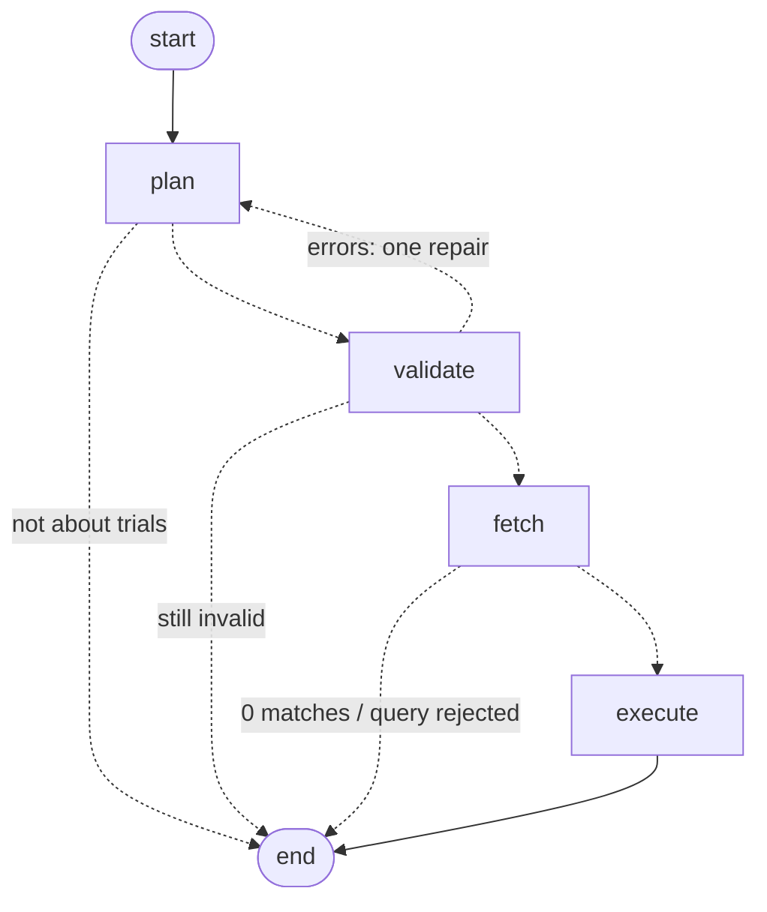

# ClinicalTrials.gov Query-to-Visualization Agent

A backend that turns a natural-language question about clinical trials into a **structured,
citation-backed visualization spec**, using live data from the
[ClinicalTrials.gov API v2](https://clinicaltrials.gov/data-api/api).

**Core rule: the LLM plans, code computes.** The model's only job is to turn the question into a
typed, validated query plan. It never sees trial data and never produces a number. Fetching,
counting, chart selection and citations are deterministic Python, so every value in a response can be
traced to specific trial records.

**At a glance**
- 6 visualization types (bar, grouped bar, time series, histogram, network graph, single metric)
  from 7 question classes, all through one plan → validate → fetch → execute pipeline.
- Deep citations on every bar, bin, node and edge: every contributing NCT ID, plus exact excerpts
  quoting the field value that put each trial there. A live audit re-fetched all 267 cited trials and
  confirmed all 490 excerpts in the example outputs ([`examples/verification.json`](examples/verification.json)).
- Questions in any language (one example is Korean); structured fields always override the LLM.
- 99 offline tests, including one proving no trial data ever reaches the LLM.

Design notes, written before any code: [`docs/implementation-plan.md`](docs/implementation-plan.md).
The commit history records the build step by step.

---

## 1. How to run

Requires Python 3.12+ and an OpenAI API key.

```bash
python3.12 -m venv .venv && source .venv/bin/activate
pip install -r requirements.txt
cp .env.example .env          # then set OPENAI_API_KEY
uvicorn app.main:app --reload
```

Interactive API docs: <http://localhost:8000/docs>. Machine-readable schema: `/openapi.json`.

```bash
curl -s -X POST localhost:8000/v1/visualize \
  -H 'content-type: application/json' \
  -d '{"query": "How has the number of trials for this drug changed over time?", "drug_name": "Pembrolizumab"}'
```

| Env var | Default | Meaning |
|---|---|---|
| `OPENAI_API_KEY` | – | Required for planning. |
| `OPENAI_MODEL` | `gpt-4.1-mini` | Must be one of the models in [`docs/openai-rules.md`](docs/openai-rules.md); anything else fails at startup. |

Tests run offline (no API key, no network), against recorded registry responses and a scripted LLM:

```bash
pytest            # 99 unit, contract and pipeline tests
pytest -m live    # opt-in: calls the real ClinicalTrials.gov API
```

Reproduce the example outputs and audit their citations against the live registry:

```bash
python -m examples.run_examples      # needs OPENAI_API_KEY; writes examples/outputs/*.json
python -m scripts.verify_examples    # re-fetches every cited trial; writes examples/verification.json
python -m scripts.record_fixtures    # re-record the offline test fixtures
```

---

## 2. Request schema

`POST /v1/visualize` with a JSON body. Only `query` is required.

| Field | Type | Required | Validation | Effect |
|---|---|---|---|---|
| `query` | string | **yes** | 1–1000 chars after trimming | The question. Any language. |
| `drug_name` | string | no | 1–200 chars | Filters by intervention (`query.intr`). |
| `condition` | string | no | 1–200 chars | Filters by condition (`query.cond`). |
| `sponsor` | string | no | 1–200 chars | Filters by **lead** sponsor (`query.lead`). |
| `country` | string | no | 1–100 chars | Filters by site location (`query.locn`). Common aliases are normalized, e.g. "Korea" → "South Korea". |
| `trial_phases` | string[] | no | each one of `EARLY_PHASE1`, `PHASE1`, `PHASE2`, `PHASE3`, `PHASE4`, `NA` | Restricts to these phases. |
| `statuses` | string[] | no | each a registry status, e.g. `RECRUITING`, `COMPLETED` | Restricts to these overall statuses. |
| `start_year` | int | no | 1900–2100 | Earliest trial start year (inclusive). |
| `end_year` | int | no | 1900–2100, ≥ `start_year` | Latest trial start year (inclusive). |
| `chart_type` | string | no | a visualization `type` (§3) | Preferred chart. Used only if it fits the question; otherwise overridden and explained in `meta.visualization_rationale`. |
| `top_n` | int | no | 1–50, default 15 | Maximum categories or nodes shown. |
| `max_records` | int | no | 100–5000, default 5000 | Maximum trial records fetched per search. |
| `max_citations_per_datum` | int | no | 0–20, default 3 | Citation excerpts attached to each datum. |

Rules:
- **Unknown fields are rejected with 422.** A misspelled filter that silently does nothing is worse than an error.
- **Structured fields override the LLM.** If `drug_name` is set, it wins over whatever drug the model
  reads from `query`; any conflict is recorded in `meta.notes`.

---

## 3. Response schema

Every response has the same envelope, and every pipeline outcome returns HTTP 200:

```jsonc
{
  "schema_version": "1.0",
  "status": "ok",            // ok | no_data | unsupported | error
  "visualization": { ... },  // present only when status is "ok"
  "meta": { ... },           // always present
  "error": { "code": "...", "message": "..." }  // present only when status is "error"
}
```

| `status` | Meaning |
|---|---|
| `ok` | A visualization was produced. |
| `no_data` | The search ran but matched no trials; `meta.queries` shows exactly what was searched. |
| `unsupported` | The question is not about clinical trials. |
| `error` | The question could not be planned into a valid query. No guessed chart is returned. |

| HTTP | When |
|---|---|
| 200 | Any of the statuses above. |
| 422 | The request body failed validation. |
| 502 | ClinicalTrials.gov or the LLM provider was unreachable after retries (body is the envelope with `status: "error"`). |

### 3.1 `visualization`

`type` selects the shape. Every `encoding.*.field` names a key that exists in **every** `data` row;
the server validates this before responding, so a renderer needs only `encoding` + `data`.

| `type` | `encoding` channels | `data` |
|---|---|---|
| `bar_chart` | `x`, `y` | rows |
| `grouped_bar_chart` | `x`, `y`, `series` | rows in long format: one per (x, series) pair, zeros filled in |
| `time_series` | `x` (temporal), `y`, optional `series` | rows, one per year (per series); empty years filled with 0 |
| `histogram` | `x` (bin start), `x2` (bin end), `y` | rows, one per bin |
| `metric` | `value` | a single row: the question needs a number, not a chart |
| `network_graph` | `node` {`id`, `label`, `size`, `color`}, `edge` {`source`, `target`, `weight`} | `{ "nodes": [...], "edges": [...] }` |

A channel is `{field, type, label, label_field?}` where `type` is `nominal`, `ordinal`,
`quantitative` or `temporal`.

**Raw value + display label.** Categorical rows carry the registry's raw value and a display label
side by side; the channel's `label_field` names the label key. Plot the raw value, print the label:

```json
{ "phase": "PHASE2", "phase_label": "Phase 2", "trial_count": 4581 }
```

### 3.2 Deep citations

Every datum (bar, time bucket, histogram bin, node, edge) carries its evidence:

```jsonc
{
  "phase": "PHASE3", "phase_label": "Phase 3", "trial_count": 41,
  "supporting_nct_ids": ["NCT01234567", "..."],   // every contributing trial, never truncated
  "citation_count": 41,
  "citations": [                                   // first max_citations_per_datum trials
    {
      "nct_id": "NCT01234567",
      "field": "protocolSection.designModule.phases",
      "excerpt": "[\"PHASE3\"]",                     // exact value from the API response
      "title": "A Study of Pembrolizumab in ...",
      "url": "https://clinicaltrials.gov/study/NCT01234567"
    }
  ]
}
```

`excerpt` is the exact field value that placed the trial in this datum (lists are JSON-encoded). For a
derived bucket such as "Phase 1/Phase 2", the excerpt is the raw `["PHASE1", "PHASE2"]`.

### 3.3 `meta`

| Field | Meaning |
|---|---|
| `interpretation` | What was computed, in words. Generated from the plan, never an LLM statement about results. |
| `queries[]` | Each ClinicalTrials.gov search that fed the chart (one per cohort in a comparison): `label`, normalized `filters`, the exact `api_params` sent, `total_matching` (the API's own count), `records_analyzed`, `truncated`. |
| `coverage` | How the numbers relate to the trials: `groupby_semantics` (`partition` = each trial in exactly one bucket, so buckets sum to the total; `overlapping` = a trial can be in several, e.g. multi-country trials), `bucket_sum`, `unclassified_count`, `overlap_note`, `excluded[]` (trials left out, by reason), `buckets_not_shown` (counted but beyond `top_n`). |
| `render` | Drawing hints: `sort` {`field`, `order`}, `time_granularity`, `units` per channel, `grouping` (the series key), `pruning` (for networks). |
| `visualization_rationale` | The chosen `type`, where it came from (`request`, `llm` or `rule_default`), any overridden suggestion, and why. |
| `assumptions[]` | Interpretation choices a reader would otherwise have to guess. |
| `notes[]` | Overrides, fallbacks, truncation and other things worth knowing about this run. |
| `plan` | The validated query plan that was executed. |
| `source`, `data_as_of`, `generated_at` | Provenance: the API and its data timestamp. |

---

## 4. Example runs

Actual outputs from live runs (OpenAI `gpt-4.1-mini` planner, registry data as of
2026-09-25). Each file in [`examples/outputs/`](examples/outputs/) holds the request and the exact
JSON the API returned. None of these hit the record cap: every count covers all matching trials.

| # | Query | Type | Result (abridged) |
|---|---|---|---|
| 1 | "How has the number of trials for this drug changed per year since 2015?" + `drug_name: "Pembrolizumab"` | `time_series` | 2,894 trials; 120 in 2015 → peak 298 in 2022 → 211 in 2026 |
| 2 | "Which countries have the most recruiting trials for breast cancer?" + `top_n: 10` | `bar_chart` | 2,452 trials; United States 924, China 648, France 202 … (overlapping: multi-country trials count in each country) |
| 3 | "Compare phases for trials involving Semaglutide vs Tirzepatide." | `grouped_bar_chart` | 760 vs 290 trials; Phase 3: 164 vs 50 |
| 4 | "Show a network of sponsors and drugs for KRAS-mutant non-small cell lung cancer trials." | `network_graph` | 79 trials; e.g. Merck ↔ Calderasib (4 trials), Eli Lilly ↔ Pembrolizumab (4) |
| 5 | "한국에서 모집 중인 위암 임상시험은 단계별로 어떻게 분포되어 있나요?" (Korean: "How are recruiting gastric cancer trials in Korea distributed across phases?") | `bar_chart` | 74 trials; Phase 1/Phase 2 18, Not Applicable 14, Phase 3 13 … |

Extra runs covering the remaining types:
[drug co-occurrence network](examples/outputs/06_extra_drug_cooccurrence_myeloma.json) (multiple myeloma:
dexamethasone ↔ lenalidomide in 66 trials),
[enrollment histogram](examples/outputs/07_extra_enrollment_histogram_psoriasis.json),
[single metric](examples/outputs/08_extra_count_pfizer.json) ("How many Phase 3 trials is Pfizer running
that are currently recruiting?" → 47, no chart needed), and an
[unsupported question](examples/outputs/09_extra_unsupported.json) (weather → `status: "unsupported"`).

**Example 5, abridged** (one of seven bars and one of three citations shown; `meta.plan`, empty
fields and `generated_at` omitted. Full file: [`05_korean_gastric_cancer_phases.json`](examples/outputs/05_korean_gastric_cancer_phases.json)):

```json
{
  "schema_version": "1.0",
  "status": "ok",
  "visualization": {
    "type": "bar_chart",
    "title": "Recruiting gastric cancer trials in South Korea by trial phase",
    "encoding": {
      "x": { "field": "phase", "type": "ordinal", "label": "Trial phase", "label_field": "phase_label" },
      "y": { "field": "trial_count", "type": "quantitative", "label": "Number of trials" }
    },
    "data": [
      {
        "supporting_nct_ids": ["NCT06663319", "NCT04389632", "NCT07812805", "... 9 in total"],
        "citation_count": 9,
        "citations": [
          {
            "nct_id": "NCT06663319",
            "field": "protocolSection.designModule.phases",
            "excerpt": "[\"PHASE1\"]",
            "title": "A Study of JNJ-89402638 for Metastatic Colorectal and Gastric Cancers",
            "url": "https://clinicaltrials.gov/study/NCT06663319"
          }
        ],
        "phase": "PHASE1",
        "phase_label": "Phase 1",
        "trial_count": 9
      }
    ]
  },
  "meta": {
    "interpretation": "Counted recruiting gastric cancer trials in South Korea in the registry, grouped by trial phase.",
    "queries": [
      {
        "filters": { "condition": "gastric cancer", "location": "South Korea", "statuses": ["RECRUITING"] },
        "api_params": { "query.cond": "gastric cancer", "query.locn": "South Korea", "filter.overallStatus": "RECRUITING" },
        "total_matching": 74,
        "records_analyzed": 74,
        "truncated": false
      }
    ],
    "coverage": { "groupby_semantics": "partition", "bucket_sum": 74, "unclassified_count": 0, "excluded": [], "buckets_not_shown": 0 },
    "render": { "sort": { "field": "phase", "order": "ascending" }, "units": { "y": "trials" } },
    "visualization_rationale": {
      "chosen": "bar_chart",
      "source": "llm",
      "reason": "A bar chart effectively shows the distribution of recruiting gastric cancer trials across different phases in South Korea."
    },
    "assumptions": [
      "Trials registered with two phases (e.g. Phase 1/Phase 2) are counted once, in a combined bucket. 'Not Applicable' (an explicit NA, typical of non-drug studies) and 'Not specified' (no phase recorded) are kept separate."
    ],
    "source": "ClinicalTrials.gov API v2",
    "data_as_of": "2026-09-25T09:00:04"
  }
}
```

The Korean question was translated by the planner into English search terms. The seven phase buckets
sum to exactly 74, the API's own `totalCount`.

**A network edge from example 4** (one citation shown, trial title omitted). The excerpt quotes both endpoints from the same record:

```json
{
  "source": "sponsor:merck sharp & dohme llc",
  "target": "intervention:calderasib",
  "weight": 4,
  "supporting_nct_ids": ["NCT06345729", "NCT07190248", "NCT07554339", "NCT07431827"],
  "citation_count": 4,
  "citations": [
    {
      "nct_id": "NCT06345729",
      "field": "protocolSection.sponsorCollaboratorsModule.leadSponsor.name + protocolSection.armsInterventionsModule.interventions[].name",
      "excerpt": "\"Merck Sharp & Dohme LLC\" | \"Calderasib\"",
      "url": "https://clinicaltrials.gov/study/NCT06345729"
    }
  ]
}
```

---

## 5. How it works

The pipeline is an explicit [LangGraph](https://github.com/langchain-ai/langgraph) state machine
([`app/graph.py`](app/graph.py)). This diagram mirrors the compiled graph's edges
(`graph.get_graph().draw_mermaid()`), with edge labels added:



| Node | Code | What it does |
|---|---|---|
| `plan` | [`planner/llm_planner.py`](app/planner/llm_planner.py), [`prompts.py`](app/planner/prompts.py) | The **only** LLM call. It sends the question and the caller's structured fields and gets back a `QueryPlanLLM` via OpenAI Structured Outputs (strict JSON schema). On a repair turn, the model also sees its previous draft and the exact validation errors. |
| `validate` | [`planner/validator.py`](app/planner/validator.py) | Converts the draft into a `QueryPlan` with real constraints, applies the caller's structured fields (they always win), fixes unambiguous slips deterministically (e.g. a time trend must group by year) and reports them. Anything else is an error sent back for one repair. |
| `fetch` | [`ctgov/`](app/ctgov/) | Builds API params, normalizes country spellings, runs one search per cohort in parallel (paging, retries, cache), and extracts each record into a `TrialRow` that keeps every value's field path and raw text. |
| `execute` | [`engine/`](app/engine/) | Deterministic. Groups and counts through a dimension registry, chooses the chart (§6), builds the network, attaches evidence, and assembles the response. |

A plan is one generic shape: `analysis` (distribution, time_trend, comparison, geographic, network,
numeric_distribution or count), `group_by`, `filters`, `compare` cohorts, `network` endpoints and
`top_n`. Every question class in the assignment's appendix maps onto it, so no question needs its
own code path.

---

## 6. Design decisions and tradeoffs

**The LLM plans; code computes.** The model never sees trial data and never emits a number, so no
value can be hallucinated. [`test_no_trial_data_reaches_the_llm`](tests/test_graph.py) captures
every message sent to the model, including a repair turn, and asserts that no NCT ID, trial title or
match count appears in them. *Tradeoff:* a question outside the plan schema can't be answered; it
gets an `error` or `unsupported` status rather than a best guess.

**Chart type: the LLM suggests, rules decide.** The planner proposes a chart with a one-line
rationale. [`chart_rules.py`](app/engine/chart_rules.py) maps each question class to the chart types
that fit its data shape. The priority is the caller's `chart_type`, then the LLM's suggestion, then
the rule default. Any override is reported, so the LLM can express judgment but can never produce
an unrenderable spec.

**Validation: repair once, fix the obvious deterministically.** Errors go back to the model once
with the exact messages; if the second draft still fails, the response is `status: "error"` and no
chart. Unambiguous slips are fixed in code and noted, which saves an LLM round trip.

**Fetch records and count locally, rather than asking the API for counts.** Counting locally is
what makes deep citations and networks possible: every datum knows exactly which trials produced
it. *Tradeoff:* the record cap (default 5,000). Above it, bucket counts cover only the first 5,000
records in the API's order; `truncated` and a note say so. Count questions are the exception: they
use the API's exact `totalCount` and fetch only enough records to cite.

**Say what the numbers mean.** `coverage.groupby_semantics` distinguishes a *partition* (phase,
status, year, sponsor: each trial in one bucket, so bars sum to the total) from *overlapping*
dimensions (country, intervention, condition: a trial with sites in five countries is in five
bars). Multi-phase trials get one combined "Phase 1/Phase 2" bucket instead of being double-counted.
An explicit `NA` phase (237,522 trials registry-wide) and a missing phase (143,294) stay separate
buckets.

**Registry behavior, measured, not assumed.** Every query syntax was checked against the live API,
which found real problems with the reference notes we were given
([`docs/api_reference.md`](docs/api_reference.md) is the corrected version):
- `filter.phase` does not exist: the API rejects it. Phases go through `filter.advanced=AREA[Phase]…`.
- Pagination returns `nextPageToken`, and `totalCount` appears only with `countTotal=true`.
- `query.spons` matches collaborators as well as lead sponsors (Pfizer: 6,087 vs 3,880), so the
  sponsor filter uses `query.lead` to agree with lead-sponsor grouping.
- Location spelling matters: "USA" matches 729 trials, "United States" 195,650; Korean script
  matches 0. A small alias map covers only the variants that measurably change results.

**Intervention names are messy; MeSH terms tidy them up.** "Pembrolizumab 200 mg IV" and
"5-Fluorouracil" are grouped under the MeSH terms the registry assigns to the record (whole-word
matching, so "IV" never matches "Ivermectin"). A combination entry like "Docetaxel and capecitabine"
yields one node per drug. Networks keep only drug-type interventions and drop placebo and
standard-of-care comparators, which would otherwise link to everything.

**Thin LangGraph layer.** The graph adds explicit state, the repair loop and early exits. Every node
is a plain function tested without LangGraph, so the framework handles only control flow.

**`gpt-4.1-mini` by default.** Planning is a small extraction task, so a fast non-reasoning model
with `temperature=0` gives repeatable plans in about a second. Any model on the company allowlist can
be configured; others are refused at startup, and a test keeps the allowlist in sync with
[`docs/openai-rules.md`](docs/openai-rules.md).

**No frontend.** The effort went into the contract instead: a discriminated union with per-type
encodings, raw values next to display labels, rendering hints, and a validator ensuring every
encoded field exists in every row. That lets a renderer be written from `/openapi.json` alone.

---

## 7. Limitations and what I would improve

- **Record cap on very large cohorts.** Above 5,000 matching trials, bucket counts cover a prefix
  of the results (clearly flagged). The next step would be an exact-count mode for dimensions with
  a fixed set of values (phase, status, sponsor type, year): one `countTotal` request per bucket. A
  live check on breast cancer (16,853 trials) confirmed 9 such requests reconcile to the exact total.
- **Matching is the registry's.** The API expands search terms itself: `query.intr=tirzepatide`
  also returns a 2007 observational study whose only listed interventions are "GLP-1 Receptor
  Agonists" and "DPP-4 Inhibitors". The service reports what the registry matches and adds no synonym
  expansion of its own; brand-to-generic mapping relies on the LLM.
- **Intervention resolution stops at MeSH.** Drugs without a MeSH term in their record (often
  investigational codes such as "Adebrelimab + SHR-8068") stay as raw names, and a combination
  entry is split only for the drugs MeSH covers.
- **Co-occurrence is not co-administration.** Two drugs in one trial may be in different arms. The
  response states this rather than implying combination therapy.
- **Citations are verified by an offline audit, not per request.** `scripts/verify_examples.py`
  re-checks excerpts against the live registry; running that check inline on every response would
  cost extra API calls.
- **In-memory cache, single process.** A shared cache (e.g. Postgres or Redis) would help a
  multi-instance deployment. There is no auth or rate limiting in front of the service.
- **Cohort filters override shared ones.** In a comparison, a cohort's own filter wins for that
  cohort, even over a structured request field; a stricter version would reject the contradiction.
- **With more time:** the exact-count mode above, a small eval set of questions with expected plans
  for regression-testing prompt changes, and a reference renderer driven only by the spec.

---

## 8. AI tools, validation, and what was deliberate

**Tools.** I used Claude Code (Anthropic's Claude) throughout, for researching the company and the
API, planning, and implementation. The service itself uses OpenAI `gpt-4.1-mini` at runtime, for
planning only.

**How I worked.** Before writing code, I wrote the plan in
[`docs/implementation-plan.md`](docs/implementation-plan.md) and made the key decisions there (D1–D20),
then had it reviewed against the assignment for gaps. Implementation followed the plan one step at a
time, one commit per step, with each commit message recording why as well as what.

**How correctness was validated.**
- **Offline tests (99).** They run on registry responses recorded with the service's own client, plus
  a scripted LLM. They cover:
  - schema contracts
  - query building
  - extraction edge cases
  - aggregation reconciling with the API's `totalCount`
  - chart-rule precedence
  - network construction and pruning
  - validator repair and override behavior
  - every pipeline exit (ok, repair, error, unsupported, no data)
  - LLM data isolation
- **Live checks.**
  - All nine example questions were run end to end through the API with the real model.
  - `scripts/verify_examples.py` re-fetched all 267 cited trials and confirmed all 490 excerpts, and
    checked that partition charts reconcile with the API's totals.
  - A unit test confirms the auditor rejects wrong excerpts, so its "0 problems" result means
    something.
- **API behavior measured before relying on it** (§6), including the enum values and labels, which
  come from the registry's own `/studies/enums` endpoint.
- **Bugs found by running the code, not by reading it**, each fixed in its own commit:
  - combination drug entries lost all but one drug;
  - a whole-word check was needed so short names didn't match inside longer ones;
  - a Pydantic serializer silently erased row fields from the OpenAPI schema, so it was removed;
  - override notes fired on case-only differences;
  - some generated titles read awkwardly.

**Deliberate vs generated.**
- **Deliberate, decided by me before implementation:**
  - the LLM-plans/code-computes boundary;
  - LLM-suggested charts validated by rules;
  - spec-level citations with complete `supporting_nct_ids`;
  - partition vs overlapping semantics;
  - `query.lead` and the location aliases;
  - a thin LangGraph layer;
  - model choice within the allowlist;
  - no frontend;
  - the Korean example;
  - deferring exact-count mode.
- **Generated with Claude Code, then reviewed and tested:** most of the implementation code and tests,
  written against that plan. Each piece was run against real data before being committed, which is
  how the bugs above were caught.
